---

## 📊 GitHub Stats & Trophies

  
  

  

---

## 🛠️ Tech Stack

<table align="center" width="100%">
<tr>
<td align="center" width="33%">

### Programming Languages

</td>

<td align="center" width="33%">

### Frontend

</td>

<td align="center" width="33%">

### Backend

</td>
</tr>

<tr>
<td align="center">

### Database

</td>

<td align="center">

### DevOps & Cloud

</td>

<td align="center">

### Tools

</td>
</tr>
</table>

---

## 📈 Most Used Languages

  

---

## 🔗 Connect With Me

  

---

## 🎮 Contribution Graph

  

  

---

  

