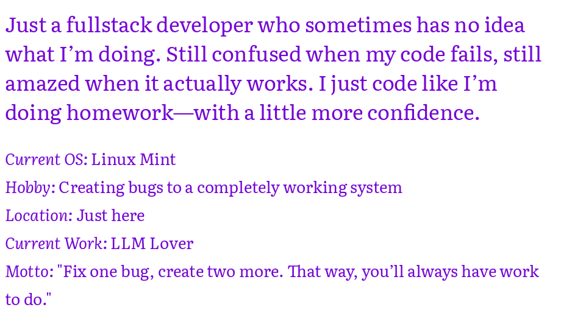

  

  

  
  
  

---

## About

| | |
|:---|:---:|
|  |  |

---

## Tech Stack

  

---

## Metrics

  
   
  
   
  

---

## Connect

  
  
  

---

  
    
  <b>© 2026 millareskenneth</b> • Thanks for exploring my work. If you find a bug, consider it part of the experience.

